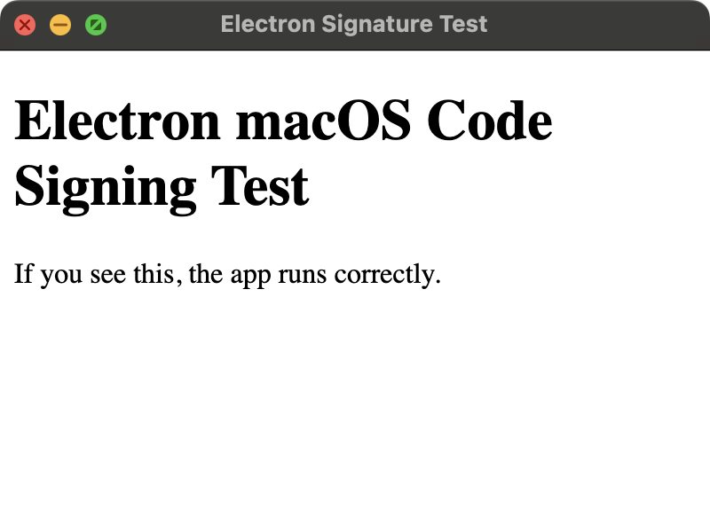

# Electron App (macOS signed build)

Este proyecto permite generar un binario para macOS, firmado con el certificado adecuado para distribución.

---

## 1️⃣ Prerrequisitos

Antes de ejecutar nada:

- Tener instalado **Yarn** (NO usar npm)

```bash
brew install yarn
````

* Tener en la raíz del proyecto los siguientes archivos y datos:

  * El certificado de firma en formato `.p12` (ejemplo: `certificate.p12`)
  * La contraseña del `.p12`

* Definir dos variables de entorno para que `electron-builder` pueda firmar:

```bash
export CSC_LINK="/ruta/completa/al/certificate.p12"
export CSC_KEY_PASSWORD="la-contraseña-del-certificado"
```

> Debes lanzar estos `export` en tu shell antes de ejecutar los comandos.

---

## 2️⃣ Instalación de dependencias

Desde la raíz del proyecto:

```bash
yarn install
```

---

## 3️⃣ Ejecutar la aplicación en desarrollo

Si quieres simplemente arrancar la app:

```bash
yarn start
```

Se abrirá la ventana de la aplicación.

---

Así es el aspecto actual de la aplicación:



## 4️⃣ Build y firma del binario

Para generar el binario firmado para macOS:

```bash
yarn dist
```

Esto generará la build en la carpeta `dist/` del proyecto.
Allí encontrarás el DMG y ZIP firmados, listos para distribución.

---

⚠ **Nota importante:**

* Solo debes usar `yarn` para manejar las dependencias.
* No ejecutar nunca `npm install` ni crear `package-lock.json`.

